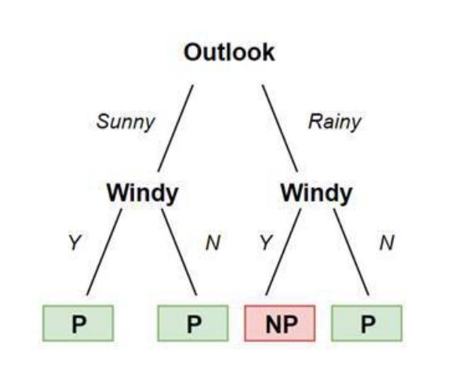

# 1. What is Machine Learning? (ML)
ML is fundamentally just a science, in which, developers focus on teaching machines or computers to perform certain tasks without being given specific information. I mean, we want our machines to learn how to do something themselves without us having to explain it to them. Before doing this, looking at how human brain works and then design virtual brains that work in a similar manner can be a great example. Now you might think that ML and AI is the same since they can do stuff without guiding, but no, they're not. AI is a broad field and every system that can learn and solve problems can be considered as an AI, but ML is one specific approach. in ML the AI doesn't recieve any instructions. It isn't static and it doesn't follow clear and strict steps to solve problems. It's dynamic.

In ML we have different approaches, two main approaches are *supervised learning* and *unsupervised learning*.
## Supervised Learning
Let's take a model, a set of inputs and also the corresponding outputs,  which are desired results. In this way the model learns to match certain inputs to certain outputs and it adjusts its structure. It learns to make connections between what was put in and what the desired output is. When well trained enough, we can use the model to make predictions for inputs that we don't know the results are for.
## Unsupervised Learning
In unsupervised learning, we don't give our model the desired results while training, not because we don't want to but because we don't know them. This approach is more like a kind of pattern recognition. We give the model a set of input data and it then has to look for patterns in it. Once trained, we can put new data and our model will need to make decisions. Since it doesn't get information it has to work with similar patterns in the data.
## Reinforcement Learning
There's a third type of ML along with a 4oth one. Here, some model with a random structure is creared, then we observe what it does and encourage it, when we like what it does. Otherwise we can also give negative feedback. The more our model does what we want it to do, the more we reinforce it and the more encouragment it gets. In this way our model can learn what is right and what is wrong. You can imagine it a little bit like natural selection and survival of the fittest.
## Deep Learning
Deep learning is just one area of machine learning, namely the one which works with natural networks. Neural networks are a very comprehensive and a complex topic.
## Why Python?
Python is widely used for ML, since it provides a lot of frameworks and tools then any other languages. There are other languages like R (rust), MATLAB and LISP but overrall, python is recommended.


# 2. Setting Up - Modules
## NumPy
NumPy module allows us to work with vectors, matrices and multi-dimensional arrays, it is crucial for linear algebra and numerical analysis.
## Matplotlib
This library is responsible for plotting graphs and visualizing data, offering numerous types of plotting, styles and graphs.
## Pandas
Pandas offers a powerful data structure. This library allows us to efficiently work with our huge amounts of interrelated data. We can merge, reshape, filter and query our data. 
## scikit-learn
This library is porbably the most important Python library for traditional ML, it features classification, regression and clustering algorithms. It also wllows us to work with support vector machines.
## Tensorflow
This is one of the most popular ML frameworks, out there developed by Google. It's a whole ecosystem for developing modern deep learning models. This means that it is mainly used for the development and training of models.
```bash
pip install numpy
pip install matplotlib
pip install pandas
pip install scikit-learn
pip install tensorflow
```

# 3. Linear Regression
One of the most basic and easiest ML algorithm is linear regression. It will be the first one that we are going to look at and it is a supervised learning algorithmm meaning we need both inputs and outputs to train a model.


In the figure above, there are a lot of different points, which all have an `x-value` and `y-value`. The `x-value` is called the feature, whereas the `y-value` is the label. The label is the result for our feature. Our *linear rehression model* is represented by the blue line that goes straight through our data. It is placed so that it is as close as possible to all points at the same time, so we "trained" the line to fit the existing points or the existing data.
The idea is now to take a new x-value without knowing the corresponding y-value. We then look at the line and find the resulting y-value there, which the model predicts for us. Since this line is quite generalized, we will relatively inaccurate result.
## Loading Data
Before getting started, we need data we will work with (Dataset from UCI)
[UCI Dataset](https://archive.ics.uci.edu/dataset/320/student+performance)
```python
import numpy as np
import pandas as pd
import matplotlib.pyplot as plt
from sklearn.linear_model import LinearRegression
from sklearn.model_selection import train_test+split
```
Our first action is to load the data from the CSV file into a Pandas Dataframe:
```python
data = pd.read_csv('student=mat.csv', sep=';')
```
it is important that we change our seperator to semicolon since the default seperator for CSV files in a comma and our file is seperated by semicolons. in the next step, we think about features that are relevant for us and what exactly we want to predict. A description of all features can be found on the previosuly mentined website. In this example, we will limit ourselves to the following columns: Age, Sex, Studytime, Absences, G1, G2, G3
```python
data = data[['age', 'sex', 'studytime', 'absences', 'G1', 'G2', 'G3']]
```
The columns *G1, G2, G3* are the three grades the students get. Our goal is to predict the third and final grade by looking at other values like first grade, age, sex and so on. We only select these columns from our DataFrame, out of the 33 possible. But we have a problem here, sex feature is not numeric, but stored as F or M. But for us to work with it and register it in the coordinate system, we have to convert it into numbers:
```python
data['sex'] = data['sex'].map({ 'F':0, 'M':1 })
```
as you can see, this id done by using the *map* function. Here we map a dictionary to our feature. Each F becomes a zero and every M becomes a one. Finally, we define the column of the desired label as a variable to make it easier to work with.
```python
prediction = 'G3'
```
## Preparing Data
Our data is now fully loaded and selected. However in order to use it as training and testing data for our model, we have to reformat them. The sklearn models do not accept Pandas data frames, but only NumPy arrays. That's why we turn our features into an x-array and our label into a y-aaray:
```python
X = np.array(data.drop{prediction},1)
Y = np.array(data[prediction])
```
This method now fully converts the selected columns into an array. The drop function returns the data frame without the specified column. Our X array now contains all of our columns, except for the final grade. The final grade is in the Y array.
In order to train and test our modelm we have to split our available data. The first part will be used to get the hyperplane, to fit our data as well as possible. The second part then checks the accuracy of the prediction, with previously unknown data:
```python
X_train, X_test, X_train, Y_train, Y_test = train_test_split(X, Y, test_size=0.1)
```
With the function `train_test_split` we divide our X and Y arrays into four arrays. The order must be exactly as shown here. The `test_size` parameter specifies what percentage of records to use for testing, in this case, it is 10%. This is also a good and recommended value. This is done to test how accurate it is with data that our model has never seen before.
## Training and testing
First we define our model
```python
model = LinearRegression()
model.fit(X_train, Y_train)
```
By using the constructor of the `LinearRegression` class, we create our model. We then use the `fit` function and pass our training data. Now our model is already trained. It has now adjusted its hyperplane so that it fits all of our values. In order to test how well our model performs, we can use the `score` method and pass our testing data;
```python
accuracy = model.score(X_test, Y_test)
print(accuracy)
```
Since the splitting of training and test data is always random, we will have slightly different results on each run. An average result could look like this: **0.9130676521162756**, but actually, 91 percent is a pretty high and good accuracy. Now that we know that our model is reliable, we can enter new data and predict the final grade:
```python
X_new = np.array([[18, 1, 3, 40, 15, 16]])
Y_new = model.predict(X_new)
print(Y_new)
```
Here, NumPy array is defined with values for our features in the right order. Then we use the *predict* method to calcukate the likely final grade for our inputs. In this case the final grade would be probably 17.
## Visualizing Correlations
Since we are dealing iwth high dimensions here,we can't draw a graph of our model. This is only possible in two or three dimensions. However what we can visualize are relationships between individual features.
```python
plt.scatter(data['studytime'], data['G3'])
plt.title('Correlation')
plt.xlabel('Study Time')
plt.ylabel('Final Grade')
plt.show()
```
Here we draw a scatter plot with the function scatter, which shows the relationship between the learning time and the final grade.


In this case we can see that the relationship is not really strong, since the data is very diverse and you cannot see a clear pattern
```python
plt.scatter(data[ 'G2' ], data[ 'G3' ])
plt.title("Correlation")
plt.xlabel("Second Grade")
plt.ylabel("Final Grade")
plt.show()
```
But herem we look at the correlation between the second grade and the final gradem we see a much stronger correlation:


Here we can see that the students with good second grades are very lkely to end up with a good final grade as well. You can play around with diferent columns of this data set.

# 4. Classification
With regression we now predicted specific output-values for certain given input-values. Sometimes we are not trying to predict outputs but to categorize or classify our elements. For this we use classification algorithms.


In given figure above we can see that one specific kind of classification algorithm, namely the *K-Nearest-Neighbor* classifier. Here we already have a decent amount of classified elements. We then add a new one (stars) and try to predict its class by looking at its nearest neighbors.
## Classification Algorithms
These are various different classification algorithms and they are often used for predicting medical data or other real life use-cases. For example, by providing a large amount of tumor samples, we can classify if a tumor is benign or malignant with a pretty high certainty.
## K-Nearest-Neighbors
As already mentioned by using the K-Nearest-Neighbors classifier, we assign the class of the new object, based on its nearest neighbors. The *k* specified the amount of neighbors to look at, e.g. we could say that we only want to look at the one neighbor who is nearest but we could also say that we want to factor in 100 neighbors. K shouldn't be a multiple of the number of classes since it might cause conflicts when we have an equal amount of elements from one class as from the other
## Naive-Bayes
The *Naive-bayes* algorithm might be a bit confusing when you encounter it the first name, howveer we are only going to discuss the basics and focus more on the implementation in Python later on.


Imagine that we have a table like the one given above, we have four input values and one label or output. The two classes are *yes* and *no* which indicate if we are going to play outside or not. But what *Naive bayes* do is to write down all the propabilities for the individual scenarios, so we should start by writing the general propability of playing and not playing. In this case, we only play three out of eight times and thus our probability of playing will be 3/8 and the probability of not playing will be 5/8. Out of the five times we had a high humidity we only played once, whereas out of the three times it was normal, we played twice, so our probability for playing when we have a high humidity is 1/5, and for playing when we have a medium humidity is 2/3. We go on like that and note all the probabilities we have in our table. Then get the classification for a new entry, we multply the probabilities together and end up with a prediction.
## Logistic Regression
Another popular classification algorithm is called `logistic regression`, even though the name says `regression` this is actually a classification algorithm. It looks at probabilities and determines how likely it is that a certain event happens, given the input data. This is done by plotting something similar to a logistic growth curve and splitting the data into two.


Since we are not using a line we are also preventing mistakes caused by outliers.
## Decision Trees
With *decision tree* classifiers, we construct a decision tree out of training data and use it to predict the classes of new elements.



This classification algorithm requires very little data preparation and it is also very easy to understand and visualize. on the other hand, it is very easy to be overfitting the model. Here the model is very closely matched to the traning data and has worse chances to make a correct prediction on new data.
## Random Forest
The last classification algorithm of this chapter is the random forest classifier. It is based on decision trees. What it does is creating a forest of multiple decision trees. To classify a new object, all the various trees determine a class and the most frequent result gets chosen. This makes the result more accurate  and also prevents overfitting. It is also more suited to handle data sets with higher dimensions. On the other hand, since the generation of the forest is random, you gave very little control over your model.
## Loading Data
IN code example, we will get our data directly from the sklearn module:
```python
import numpy as np
from sklearn.model_selection import train_test_split
from sklearn.neighbors import KNeighborsClassifier
from sklearn.datasets import load_breast_cancer

data = load_breast_cancer()

print(data.feature_names)
print(data.target_names)
```
We load data with given function and get the names of the features and targets. Our features are all parameters that should help to determine the label or the taret. For the targets, we have two options in this dataset: malignant and benign

## Preparing Data
Once again, we convert our data back into NumPy arrays and split them into training and test data
```python
X = np.array(data.data)
Y = np.array(data.target)

X_train, X_test, Y_train, Y_test = train_test_split(X, Y, test_size=0.1)
```
The data attribute refers to our features and the target attribute points to the classes or labels. Then, we again choose a test size of ten percent.
## Training and testing
We first start by defining our `K-Nearest-Neighbors` classifier and then training it:
```python 
knn = KNeighborsClassifier(n_neighbors=5)
knn.fit(X_train, Y_train)
```
In this example the `n_neighbors` parameter specifies how many neighbor points we want to consider. In this case, we take five, then we test our model again for its accuracy:
```python 
accuracy = knn.score(X_test, Y_test)
print(accuracy)
```
After this, we get a decent accuracy for such complex task, such as `0.9649122807017544`
## Best Algorithm 
Now let's put all the classification algorithms that we've discussed up until now to use and see which one performs best.
```python 
from sklearn.neighbors import KNeighborsClassifier
from sklearn.naive_bytes import GaussianNB
from sklearn.linear_model import LogisticRegression
from sklearn.tree import DecisionTreeClassifier
from sklearn.ensemble import RandomForestClassifier
```
As we import all the models, we now can create five different classifiers to train and test them with the exact same data:
```python 
clf1 = KNeighborsClassifier(n_neighbors=5)
clf2 = GaussianNB()
clf3 = LogisticRegression()
clf4 = DecisionTreeClassifier()
clf5 = RandomForestClassifier()

clf1.fit(X_train, Y_train)
clf2.fit(X_train, Y_train)
clf3.fit(X_train, Y_train)
clf4.fit(X_train, Y_train)
clf5.fit(X_train, Y_train)

print(clf1.score(X_test, Y_test))
print(clf2.score(X_test, Y_test))
print(clf3.score(X_test, Y_test))
print(clf4.score(X_test, Y_test))
print(clf5.score(X_test, Y_test))
```
When running the program for the first time we can't really say which algorithm is the best, but everytime we run the script, we will see different results, for this specific data set.
## Predicting labels
We can again make predictions for new, unknown data. The chance of success in the classification is even very high. We need to pass an array of input values and use the `predict function`
```python 
X_new = np.array([[...]])
Y_new = clf.predict(X_new)
```
Unfortunately, visualizing data is impossible here since we have 30 features and cannot draw a 30-dimensinal coordinate system.
# 5. Vector Machines 
Topic after topic, mathematically things get bit more demanding. *Support Vector Machines* are very poweful, very effecient machine learning algorithms and they can even achieve much better results than neural network in some areas. We are again dealing with classification here but methodology is quite different. What we are looking for is a *hyperplane* that distinctly classifies our data points and has the maximum margin to all of our points. We want our model to be as generalized as possible.


In the graph, the model is very general and the line is the optimal function to seperate our data. We cam use an endless amount of lines to seperate the two classes but we don't want to overfit our model so that it only works for the data we already have. We also want it to work for unknown data.


This model also seperates the data we already have perfectly, but we've got a new red point data here. When we look at it, it is obvious that this point belongs to the orange triangles, but however, our model classifies it as a blue circle because it is overfitting our current data. To find our perfect line we are using so-called `support vectors` which are parallel lines.


We are looking for the two points that are the farthest away from the other class. In between of those, we draw our hyperplane so that the distance to both points is the same and as large as possible. The two parallel lines are the support vectors. In between the orange and the blue line there are no data points. This is our margin, We want this margin to be as big as possible because it makes our predictions more reliable.
## Kernel
The data we have looked at so far is relatively easy to classify because it is clearly seperated. Such data can almost never be found in the real world. We are often working in higher dimensions with many features. This makes things more complicated.


Data taken from the real world often looks like this in figure. Here it's impossible to draw a straight line, even a quadratic or a cubic function does not help us here. In such cases we use so-called *kernels*, which add a new dimension to our data. By doing we increase the complexity of the data and possibly use a hyperplane as a separator. Notice that the kernel should be derived from the data that we have. We are just making it more abstract. A kernel is not some random feature but a combination of the features we already have. We can define our kernel to be whatever we want. For example we could define it as the result of dividing feature one by two. But that wouldn't be reasonable nor helpful. Therefore there are pre-defined and effective kernels we can choose from.
## Soft Margin
Sometimes we will encounter statistical outliers in our data. It would be very easy to draw a hyperplane that seperates the data into the classes, if it wasn't for these outliers.


In the given figure, there is a data set. We can see that almost all of the orange triangles are in the top first third, along with blue dots that are almost all in the bottom two thirds. There is still a problem with the outliers. Instead of using a kernel or polynomial function to solve this problem, we can define a so-called *soft margin*, with this we allow for conscious misclassification of outliers in order to create a more accurate model. Caring too much about these outliers would be again mean overfitting the model.


In this example, even though two data points are misclassifying, our model is pretty accurate and stable.
## Loading Data
For this ML algorithm, we are going to use the breast cancer data set:
```python 
from sklearn.svm import SVC
from sklearn.datasets import load_breast_cancer
from sklearn.neighbors import KNeighborsClassifier
from sklearn.model_selection import train_test_split
```
Besides all the modules, we are importing `SVC module`, which is the support vector classifier that we are going to use as our model. Notice that we are akso importing the `KNeighborsClassifier` again, since we are going to compare the accuracies at the end.
```python
data = load_breast_cancer()

X = data.data
Y = data.target

X_train, X_test, Y_train, Y_test = train_test_split(X, Y, test_size=0.1, random_state=30)
```
Here we use a new parameter `random_state` which is a seed that always produces the exact same split of our data. Usually the data gets split randomly every time we run the script. You can use whatever number you want here. Each number creates a certain split which doesn't change no matter how many times we run the script. We do this in order to be able to objectively compare the different classifiers
## Training and Testing
So first we define our support cevtor classifier and start training it:
```python
model = SVC(kernel='linear', C=3)
model,fit(X_train, Y_train)
```
So we arre using two parameters when creating an instance of the SVC class. The first one is our *kernel* and the second one is the *C* which is our soft margin. Here we choose a linear kernel and allow for three misclassifications. We could also use: poly, rbf, sigmoid, precomputed or a self-defined kernel. They are all effective in certain situations but also a lot more time intensive than linear kernels.
```python
accuracy = model.score(X_test, Y_test)
print(accuracy)
```
When we now score out model, we should see a very good result.

Now let's take a look at the *KNeighborsClassifier* with the same *random_state*:
```python 
knn = KNeighborsClassifier(n_neighbors=5)
knn.fit(X_train, Y_train)
knn_accuracy = knn.score(X_test, Y_test)
print(knn_accuracy)
```
The result will be a tiny but worse but when data becomes larger and more colmex we might see a bigger difference.
# 6. Clustering
*Clustering* is an unsupervised learning algorithm, meaning that we don't have the result for our inputs. We can't really tell our model what is right and what is wrong. It has to find pattern on its own. The algorithm gets raw data and tries to divide it up to clusters. K-Means-Clustering is the method that we are going to use here, similar to K-Nearest-Neighbors, the K states the amount of clusters we want.
## How Clustering Actually Works
The clustering itself works with so called *centroids*. These are the points which lie in the center of the respective clusters


The figure illustrates quite well how clustering works. First we randomly place centroids somewhere in our data. This is the *initialization*, here we defined three clusters which is why we also have three centroids. Then we look at each individual data point and assign the cluster of the nearest centroid to it. When we have done this, we continue by realigning our centroids. Then we place them in the middle of all points of their cluster. After that we again reassign the points to the new centrioids. We continue doing this over and over again until almost nothing changes anymore. Then we will hopefully end up with the optimal clusters. Then the result looks like this: 


You will probably never find data that looks like this in the real world. We are working with much more complex data and much more features.
## Loading Data
For clustering algorithms, we will use a dataset of handwritten digits. Since we are using unsupervised learning, we are not going to classify the digits. We are just going to put the into clusters with folloing imports:
```python
from sklearn.cluster import KMeans
from sklearn.preprocessing import scale
from sklearn.datasets import load_digits
```
We will also use this function for preparing data
```python
digits = load_digits()
data = scale(digits.data)
```
## Training and Predicting
After preparing data we can now train our model in the same way as we trained the supervised learning models up until now
```python
clf = KMeans(n_clusters=10, init="random", n_init=10)
clf.fit(data)
```
Here we are passing three parameters: first one defines the amount of clusters we want to have. Since we are dealing with the digits 0 to 9, we create ten different clusters. Second parameter chooses the way of initialization. Here we chose random, which means that we randomly place centroids somewjere. The last/third parameter states how many times the algorithm will be run with different centroid seeds to find the best clusters. Since we are dealing with unsupervised learning here, scoring the model is not really possible. You won't be able to really score if the model is clustering right or not. We could only benchmark certain statistics like *completeness* or *homogeity*. What we can do is to predicct which cluster a new input belongs to:
```python
clf.predict([...])
```
In this case, inputting data might be quite hard, since we would need to manually put in all pixels. You could either try to write a script what converts images into NumPy arrays or you could work with a much simpler data set. Also, since we are working with huge dimensions here, visualization is quite hard. When you work with two or three dimensional data, you can use the Matplotlib knowledge from volume three in order to visualize your model.
# 7. Neural Networks
As mentioned in the beginning, *neural networks* are a very complex and comprehensive topic. Way too comprehensive to cover it as in one topic. 
## Structure of a Neural Network
With neural networks we are trying to build our models on the structure of the human brain, namely with neurons. The human brain is composed of multiple billions of neurons which are disconnected. Neural networks are structures which try to use a similar principle.


In the example above, we can see three kayers. First is the input layer, at the end output layer and in between the hiddden layer. The input layer is where our inputs go. There we put all the things which are being entered or sensed by the script or the machine. Basically these are our features. We can use neural networks to classify data or to act on inputs and the output lyer is where we get our results. These results might be a class or action steps. Maybe when we input a high temperature into our model, the output will be the action of cooling down the machine. All the layers between input and output are called *hidden layers*. They make the model more abstract and more complex. They extend the internal logic. The more hidden layers and neurons you add, the more sophisticated the model gets.


This example has two hidden layers, one with four and one with three neurons. Notice that every neuron of a layer is connected to every neuron of the next layer.
## Structure of a Neuron


To understand neural networks better, you have to understand a single neuron itself. As you can see eevery neuron has a certain input, which is either the output of another neuron or the input of the first layer. This number now gets multiplied by each of the *weights*. After that, we substract *bias* b. The results of these calculations are the outputs of the neuron. This image is an outdated version of a neuron called a *perceptron*. Nowadays, we are using more complex neurons like the *sigmoid neurons* which use more sophisticated activation functions to calculate the outputs. 
## How Neural Networks Work
This has everything to do with AI and ML, since neural networks are structures with a huge amount of parameters that can be changed, we can use certain algorithms so that the model can adjust itself. We input our data and the desired outcome. Then the model tries to adjust its weights and biases so that we can get from our inputs to the respective outputs. Since we are dealing with multiple thousands of neurons, we can't do all this manually. We use different algorithms like `backpropagation` and `gradient descent`, to optimize and train our model.
## Recognizing Handwritten Digits
```python 
import numpy as np
import tensorflow as tf
import matplotlib.pyplot as plt
```
The handwritten digits data that we are going to use is provided by *Tensorflow Keras* datasets. It's so called `MNIST` dataset which contains 70,000 images of handwritten digits in the resolution of 28x28 pixels.
```python
mnist = tf.keras.datasets.mnist
(X_train, Y_train),(X_test, Y_test) = mnist.load_data()
```
The *mnist* class that is imported here has the function *load_data*, which returns two tuples with two elements each. The first tuple contains our training data and the second one our test data. In the training data we can find 60,000 images and in the test data 10,000. The images are strored in the form of NumPy arrays which contain the information about the individual pixels. Now we need to normalize our data to make it easier to handle:
```python 
X_train = tf.keras.utils.normalize(X_train)
X_test = tf.keras.utils.normalize(X_test)
```
By normalizing our data with the *normalize* function of the *keras.utils* module, we scale our data down. We standardize it as we have already done before. Notice that we are normalizing the X-values sinceit wouldn't make a lot of sense to scale down our results, which are the digits from 0 to 9.
## Building Neural Network
We have prepared our data so that we can now start building our network. Tensorflow offers us a very easy way to construct neural networks. We just create a model and then define the individual layers in it.
```python
model = ft.keras.models.Sequential()
model.add(tf.keras.layers.Flatten(input_shape=(28, 28)))
model.add(tf.keras.layers.Dense(units=128, activation='relu'))
model.add(tf.keras.layers.Dense(units=128, activation='relu'))
model.add(tf.keras.layers.Dense(units=10, activation=tf.nn.softmax))
```
First we define our model to be a *sequential*. This is a linear type of model where which is defined layer by layer. Once we have defined the model, we can use the add function to add as many different layers as we want. The first layer that we are adding here is the input layer. In our case, this is a *Flatten* layer. This type of layer flattens the input. As you can see, we have specified the input shape of 28x28. What Flatten does is to transform this shape into one dimension which would be here 784x1. All the other layers are of the class *Dense*. This type of layer is the basic one which is connected to every neuron of the neighboring kayers. We always specify two parameters here. FIrst, the units parameter which states the amount of neurons in this layer and second the activation which specifies which activation function we are using. We have two hidden layers with 128 neurons each. The activation function that we are using here is called *relu* and stands for *rectified linear unit*. This is a very fast and a very simple function. It basically just returns zero whenever our input is negative and if the input is whenever positive.


We use it because it is quite simple, quite powerful, very fast and prevents negative values. For our output layer we only use ten neurons and a different activation function. This one is called *softmax* and what it does is it picks output values so that all of our end results add up to one. Because of this we are getting ten different probabilities for each digit, indicating its likelihood. Our model is now defined but before we can start working with it, we have to compile it first. By doing this we define certain parameters and configure it for training and testing.
```python
model.compile(optimizer='adam', 
              loss='spare_categorical_crossentropy',
              metrics=['accuracy'])
```
Here we define three things, namely the *optimizer*, the *loss function* and the *metrics* that we are intested in. We are not going into the deep maths of *adam* optmizer, or the loss function. However these are very popular choices, especially for tasks like this one.
## Training and Testing 
```python 
model.fit(X_train, Y_train, epochs=3)
loss, accuracy = model.evaluate(X_test, Y_test)
print('Loss:', loss)
print('Accuracy: ', accuracy)
```
We use the *fit* function to train our model but this time we have an additional parameter names *epochs*. The number of epochs is the number of times that we feed the same data into the model over and over again. By using *evaluate* function, we get two values: loss and accuracy. The accuracy is the percentage of correctly classified digits and therefore we want to keep it as high as possible. The loss on the other hand is not a percentage but a summation of the errors made that we want to minimize. When running the test, we have a pretty high accuracy around 97%.
## Predicting Your Own Digits
Now that we have trained such an awesome model, we of course want to play with it. So what we are going to do it to read in our own images of handwritten digits and predict them with our model. For this you can either use software like Paint or Gimp and draw 28x28 pixel images or you can scan digits from real documents into your computer and scale them down to this size. But we will need an additional library here that we haven't installed yet.
```bash
pip install opencv-python
```
This is called *OpenCV* and is mainly used for computer vision. However we will use it in order to read in our images. The import looks a little bit different that the installation.
```python
import cv2 as cv
```
Now the only thing we need to prepare is a 28x28 image of a handwritten digit. Then we can start coding.
```python
image = cv.imread('digit.png'[:,:,0])
image = np.invert(np.array([image]))
```
We use the `imread` method to read our image into the script. Because of the format we remove the last dimension so that everything matches with the input necessary for the neural network. Also we need to convert our image into a NumPy array and invert it, since it will confuse our model otherwise. Finally we just have to use the *predict* function of our model on our image and see it how it works.
```python
prediction = model.predict(image)
print('Prediction: {}'.format(np.argmax(prediction)))
plt.imshow(image[0])
plt.show()
```
The prediction we get is an array of the ten different probabilities calculated by the softmax activation function. By using the argmax method, we get the index of the highest probability, which at the same time is the respective digit. Last but not least, we use Matplotlibs imshow function, to display the image we just scanned.


If looking for a challenge, you can try the same thing by using a Support Vector Machine, since it usually performs better that a neural network at this particular task.
# 8. Optimizing Models
Up until now we always loaded our data, trained and tested our model and then used it. But sometimes the training is very time-intensive and we don't want to train the model every time we run the script again. Training it one time is enough
## Serialization
For this reason, there is a concept of *serialization*. We use it to save objects into files during runtime. By doing this, we are not only sabing the attributes but the whole state of the object. Because of that, we can load the same object back into a program later and continue working with it. To work with serialization in python, we need to import `pickle` module:
```python
import pickle
```
## Saving Models
As our example, we will use the breast cancer classification script that uses SVMs:
```python
import pickle
from sklearn.svm import SVC
from sklearn.datasets import load_nreast_cancer
from sklearn.model_selection import train_test_split

data = load_breast_cancer()

X = data.data
Y = data.target

X_train, X_test, Y_train, Y_test = train_test_split(X, Y, test_size=0.1)

model = SVC(kernel='linear', C=3)
model.fit(X_train, Y_train)
```
Here we now have a fully trained model and we could also go ahead and score it but we dont want to use it right now. We want to save it so that we can use it in the future whenever we need it:
```python 
with open('model.pickle', 'wb') as file:
    pickle.dump(model, file)
```
We are opening a file stream in the *write bytes* mode. Then we use the dump function of pickle, to save our model into the specified file.
## Loading Models
Loading models is now quite simple. We can write a completely new script and use the model there.
```python 
import pickle 
with open('model.pickle', 'rb') as file:
    model = picke.load(file)

model.predict([...])
```
## Optimizing Models
We can use this serialization principle in order to train our model in the best way possible and to optimize it:
```python 
best_accuracy = 0

for x in range(2500):
    X_train, X_test, Y_train, Y_test = train_test_split(X, Y, test_size = 0.1)

    model = SVC(kernel='linear', C=3)
    model.fit(X_train, Y_train)

    if(accuracy > best_accuracy):
        print("Best accuracy: ", accuracy)

        with open('model.picke', 'wb') as file:
            pickle.dump(mode, file)
```
The concept is quite simple. We define a variable *best_accuracy* which starts with the value of zero. Then we run a loop with 2500 iterations and we train our model over and over again with a different split for our data and different seeds. When we test the model, we check if the accuracy is higher that the highest measured accuracy. 
# 9. Example/Conclusion
The model I'm going to build and show you will be about **Personalized Content Recommendation System**. This system will use a `K-Means clustering` algorithm to segment users into groups based on their interests and demographics. Then a `Neural Network` will predict the probability of a user liking a new content item based on their demographic and interest-based cluster. Example data includes *user demographic information*, such as age, location and gender, along with *user interests*, with a list of topics with the degree of interest and lastly, *content*, which are different pieces of content labeled by categories.
```python
import numpy as np
import pandas as pd
from sklearn.cluster import KMeans
from sklearn.preprocessing import StandardScaler
from sklearn.model_selection import train_test_split
from tensorflow.keras.models import Sequential
from tensorflow.keras.layers import Dense
from tensorflow.keras.optimizers import Adam

data = {
    'age':[25,30,35,40,23,29,41],
    'location':['NY', 'CA', 'TX', 'NY', 'TX', 'CA', 'NY'],
    'gender': ['M', 'F', 'M', 'F', 'M', 'M', 'F'],
    'tech_interest': [8, 5, 9, 6, 7, 8, 4],
    'sports_interest': [2, 8, 3, 7, 2, 1, 6],
    'music_interest': [5, 6, 7, 5, 3, 9, 2],
}

data['location'] = pd.Categorical(data['location']).codes
data['gender'] = pd.Categorical(data['gender']).codes
# Function used to convert a column, in this case into a categorical data type in pandas, which are more memory-efficient and allow for faster operations when dealing with columns that have a limitednumber of unique values. .codes = after converting column into a Categorical type, this attribute provides the numerical representation of each category.

df = dp.DataFrame(data)

scaler = StandartScaler()
scaled_features = scaler.fit_transform(df)

kmeans = KMeans(n_clusters=3, random_state=42)
df['cluster'] = kmeans.fit_predict(scaled_features)

X = df.drop(columns=['cluster'])
Y = np.random.choice([0,1], size=(df.shape[0],))

X_train, X_test, Y_train, Y_test = train_test_split(X, Y, test_size=0.3, random_state=42)

model = Sequential()
model.add(Dense(64, input_dim=X_train.shape[1], activation='relu'))
model.add(Dense(32, activation='relu'))
model.add(Dense(1, activation='sigmoid'))
model.compile(optimizer=Adam(), loss='binary_crossentropy', metrics=['accuracy'])
model.fit(X_train, Y_train, epochs=50, batch_size=10, validation_data=(X_test, Y_test))

user_data = np.array([[28, 1, 1, 7, 3, 5]])
user_data_scaled = scaler.transform(user_data)
cluster = kmeans.predict(user_data_scaled)

interest_pred = model.predict(user_data_scaled)
print(f"Predicted Probability of user liking content: {interest_pred[0][0]:.2f}")
```